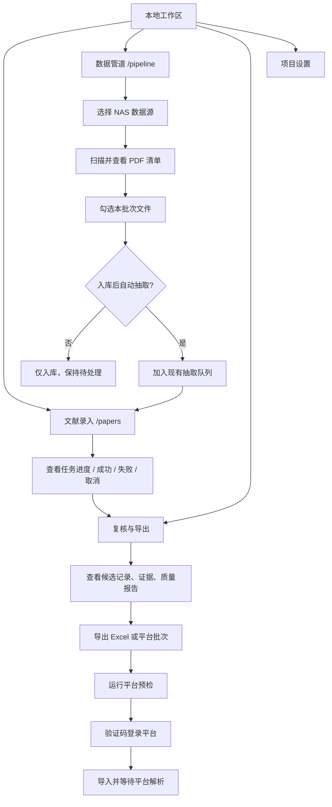
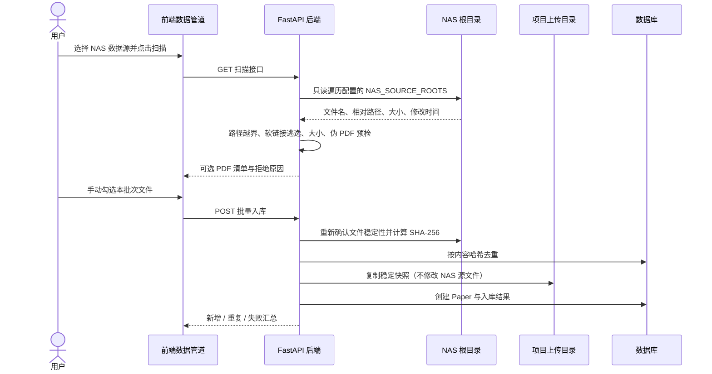
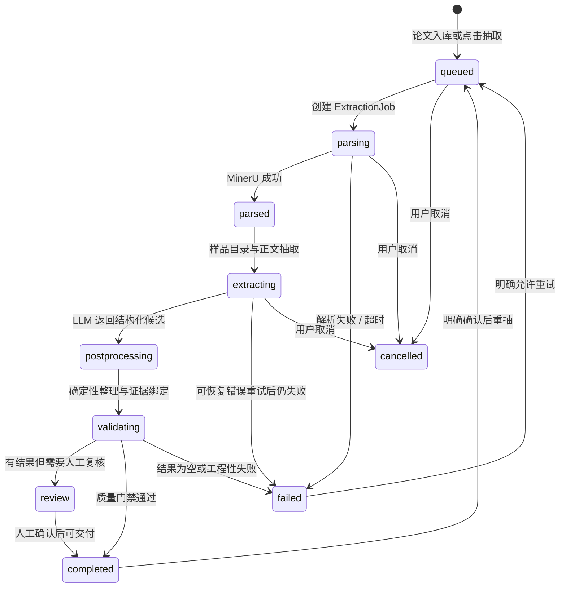
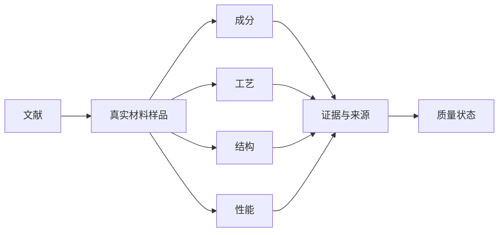
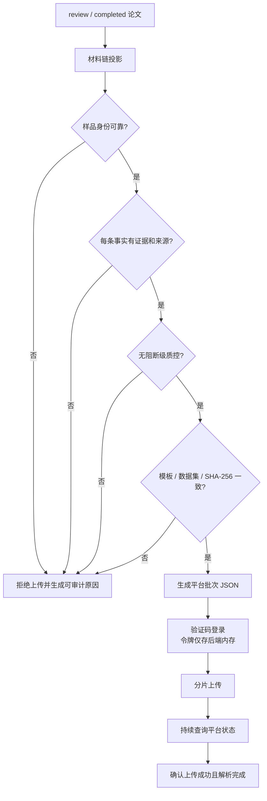
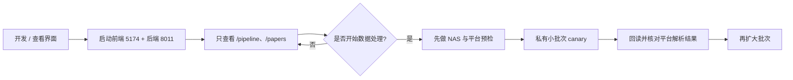

# AI4S 材料文献数据链路（当前实现）

本文记录当前项目从 NAS 文献到本地结构化数据，再到新材料大数据中心平台的完整链路。重点是“数据如何流动、每一步做什么、在哪些条件下允许继续”，不是某一次抽取任务的运行日志。

> 当前本地查看模式：前端 `http://127.0.0.1:5174`，后端 `http://127.0.0.1:8011`。本地服务可以只启动界面而不触发抽取。
>
> 模型服务由项目配置决定。最近已验证的抽取批次使用 `zhipu-glm / glm-5.2`；API Key、平台账号和验证码只在运行时使用，不写入本文档、数据库或提交记录。

## 1. 一张图看完整链路

```mermaid
flowchart LR
    U[用户打开本地前端\n/pipeline 或 /papers]
    NAS[(NAS 文献库\nPDF 文件)]
    S[只读扫描 NAS\n安全相对路径]
    D{文件预检通过?\n大小 / PDF / 路径 / 稳定性}
    H[SHA-256 内容去重]
    I[复制稳定快照到\n项目 UPLOAD_DIR]
    DB[(本地数据库\n项目 / 论文 / 任务 / 事实 / 证据)]
    Q[抽取队列\n单篇任务 + 进度事件]
    P[MinerU 解析\n版式 / 表格 / Markdown / JSON]
    L[LLM 结构化抽取\n样品目录、成分、工艺、结构、性能]
    V[确定性后处理与质量校验\n证据、样品归属、数值、重复、状态]
    R{论文可交付?\nreview / completed}
    E[本地复核\n候选记录、证据、报告]
    M[材料链投影\n文献与样品 → 成分 → 工艺 → 结构 → 性能]
    F{平台预检通过?\n真实样品 / 完整证据 / 无阻断质控}
    J[生成确定性平台批次 JSON\n模板、数据集、SHA-256 绑定]
    C[平台验证码登录\n内存会话令牌]
    X[分片上传批次]
    Y[轮询上传与解析状态]
    Z{上传且解析确认?}
    OUT[(新材料大数据中心\n目标数据集)]
    DL[下载已验证 JSON\n平台人工导入兜底]
    STOP[拒绝 / 待复核\n保留原始数据与原因]

    U --> S
    NAS --> S
    S --> D
    D -- 否 --> STOP
    D -- 是 --> H
    H --> I --> DB
    I --> Q
    Q --> P --> L --> V --> DB
    V --> R
    R -- 否 --> E
    R -- 是 --> E --> M --> F
    F -- 否 --> STOP
    F -- 是 --> J
    J --> C --> X --> Y --> Z
    Z -- 是 --> OUT
    Z -- 否 / 平台异常 --> DL
```

## 2. 用户在前端看到的操作面

“数据管道”页面把 NAS 扫描、批量入库、抽取入口、平台连接、平台预检和平台导入放在同一条工作流中；“文献录入”页面负责逐篇查看任务状态；“复核与导出”页面负责检查结构化结果和证据。

## 3. NAS 入库流程

关键约束：

- NAS 只读，原始文件不被改名、移动或删除。
- 浏览器只提交安全相对路径，后端重新解析并校验真实路径，避免路径穿越。
- 以 SHA-256 作为内容去重依据，不以文件名作为唯一标识。
- 同批次某个文件失败不会阻断其他文件；失败项带原因进入结果汇总。
- 源文件先复制为稳定快照，再进入后续解析和抽取，避免 NAS 文件在处理期间变化。

## 4. 单篇抽取流程

抽取内部可以概括为：

1. **解析**：MinerU 读取 PDF 版式、表格、页面块，并缓存 Markdown/JSON 产物；同一文献和同一解析配置优先复用缓存。
2. **样品目录先行**：先识别论文中的真实材料样品、样品编号、别名和材料形态，作为后续事实归属的基准。
3. **结构化抽取**：围绕材料事实抽取成分、工艺、结构、性能，并保留原始值、数值、范围、单位、方法和条件。
4. **证据绑定**：每条可交付事实必须关联原文证据和来源位置，不能只保留模型生成的摘要。
5. **后处理**：规范数值和单位，清理表格脚注与抽取过程字段，去重并修正样品串线。
6. **事务提交**：新样品卡、事实、候选记录、证据和质量结果在一个数据库事务中替换；失败、超时或取消时保留上一版完整结果。

## 5. 交付数据的核心结构

平台主表的阅读顺序固定为：

> **文献与样品 → 成分 → 工艺 → 结构 → 性能 → 证据**

抽取引擎、模型、任务耗时、上传哈希等过程字段只用于审计和质量报告，不应混入科研主表。平台导入时，一个交付记录对应一个真实材料样品；介质、空白对照、纯表征样品、无法确认归属的样品和不完整材料链会被排除或标记为待复核。

## 6. 平台导入门禁与上传链路

平台导入前至少检查：

- 论文状态属于 `review` 或 `completed`，不能把尚未完成抽取的论文直接导入。
- 样品编号、样品别名和样品归属有足够置信度，不能把一个样品的事实挂到另一个样品。
- 成分、工艺、结构、性能事实都有原文证据和来源位置。
- 过滤抽取过程日志、低置信度样品、介质/空白对照、伪工艺、表格脚注污染和无法安全对齐的重复指标。
- 模板 ID、数据集 ID、模板指纹（SHA-256）必须是同一套绑定；任一不匹配，上传前直接拒绝。
- 同一源数据生成确定性批次指纹；已成功或正在解析的同一批次只查询既有状态，避免重复上传。

平台会话的密码和验证码不进入数据库；令牌只保存在后端内存，服务重启或会话过期后需要重新登录。平台不可用时，后端保留同一个已验证 JSON 批次，允许下载后人工导入。

## 7. 当前推荐的稳健运行方式

本地只看界面时，只需要启动前后端并访问：

- `http://127.0.0.1:5174/pipeline`
- `http://127.0.0.1:5174/papers`

不要点击“入库后自动抽取”“开始抽取”“导入平台”等按钮，即可保持纯查看状态。启动界面本身不会扫描 NAS、调用模型或上传平台。

## 8. 失败处理原则

| 失败位置 | 系统行为 | 是否影响原数据 |
|---|---|---|
| NAS 单个文件不可读或不合规 | 记录拒绝原因，继续处理同批其他文件 | 不影响 NAS 源文件 |
| MinerU 解析失败 | 任务失败，可明确重试 | 保留旧结果 |
| LLM 网络、限流或超时 | 按可恢复策略重试，仍失败则回滚本次事务 | 保留旧结果 |
| 样品归属或证据不安全 | 进入待复核或平台预检拒绝 | 本地审计数据保留 |
| 模板 / 数据集 / 指纹不匹配 | 上传前硬拒绝 | 不产生平台副作用 |
| 平台上传成功但解析未完成 | 保存回执，继续轮询，不重复上传 | 批次 JSON 可复用 |
| 平台暂时不可用 | 保留已验证批次 JSON，允许人工导入 | 不丢失本地结果 |

## 9. 组件与职责对照

| 组件 | 主要职责 |
|---|---|
| React + Vite 前端 | 展示项目、NAS 清单、任务进度、复核和平台导入操作 |
| FastAPI 后端 | 权限边界、文件校验、任务编排、质量门禁、导出和平台调用 |
| SQLite / PostgreSQL | 保存项目、论文、任务、样品目录、事实、证据、候选和回执 |
| MinerU | 将 PDF 转为可检索的页面、表格和结构化解析产物 |
| GLM / 其他兼容 LLM | 从证据上下文中识别样品并抽取材料事实 |
| `extractor_v7` | 样品身份、事实后处理、确定性校验和质量增强 |
| `platform_material_chain_adapter` | 将本地材料链投影为平台需要的原子事实 |
| `platform_delivery` | 模板绑定、批次生成、验证码会话、分片上传和状态回读 |

## 10. 当前状态说明

- 本地前端和后端可以单独启动；当前查看界面不会自动启动抽取。
- 旧数据不会因为启动服务、查看页面或导出文件而被清除。
- 抽取与平台上传是两个明确阶段，中间有本地复核和平台预检门禁。
- 任何不能证明“属于哪个真实材料样品”的事实，宁可留在本地待复核，也不直接上传到平台。
